# TP Spring Boot – Gestion des Produits

## Objectif

Ce projet a été réalisé dans le cadre d'un TP pour mettre en pratique les concepts suivants :

- Spring Boot
- Spring Data JPA
- Hibernate
- Spring MVC
- Thymeleaf
- Spring Security

L'objectif est de développer une application web permettant de gérer des produits.

---

## Architecture JPA / Hibernate

Le schéma suivant montre comment **JPA et Hibernate permettent la communication entre l'application et la base de données.**


---

## Architecture Spring MVC

Le schéma suivant illustre le fonctionnement du modèle **Spring MVC** et le flux des requêtes HTTP entre le navigateur, le contrôleur et la vue.


---

# Technologies utilisées

- Java
- Spring Boot
- Spring MVC
- Spring Data JPA
- Hibernate
- Thymeleaf
- Spring Security
- MySQL
- H2 Database
- Bootstrap

---

# Étapes de réalisation

##  Étape 1 : Création du projet Spring Boot

La première étape consiste à créer un projet **Spring Boot** en utilisant l'outil **Spring Initializr** avec les dépendances suivantes :

- Spring Web
- Spring Data JPA
- H2 Database
- MySQL Driver
- Thymeleaf
- Lombok
- Spring Security
- Spring Validation
### Configuration de l'application

Le fichier `application.properties` permet de configurer la connexion à la base de données et les paramètres JPA/Hibernate :

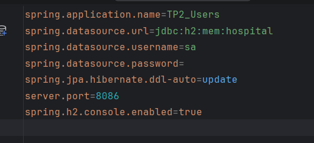


---

## Étape 2 : Création des entités

Dans cette étape, nous avons créé les entités principales de l'application : **Patient**, **Médecin**, **RendezVous** et **Consultation**.  
Ces entités représentent les tables de la base de données et permettent de modéliser le système de gestion des patients et des consultations.


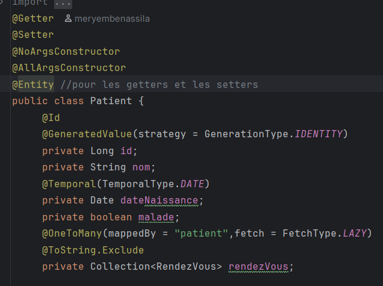

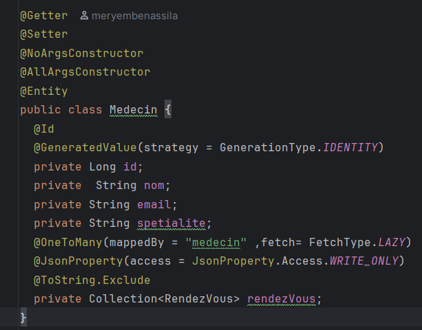

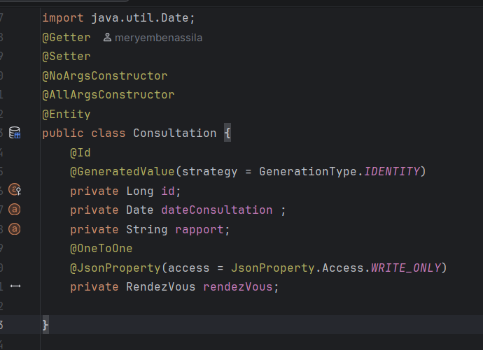

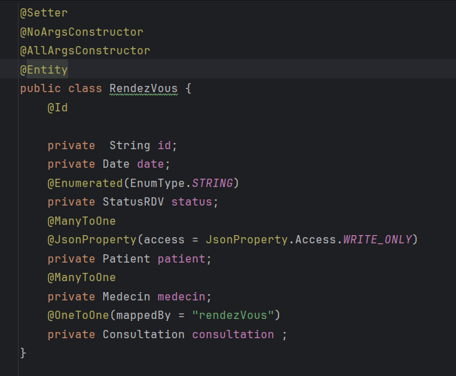

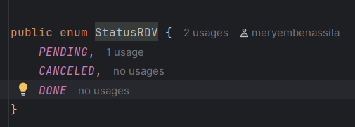
---

### Étape 3 : Création des interfaces Repository

Dans cette étape, nous avons créé les interfaces **PatientRepository**, **MedecinRepository**, **RendezVousRepository** et **ConsultationRepository**.  
Ces interfaces étendent l'interface **JpaRepository** afin de permettre l'accès aux données dans la base de données.

Grâce à **Spring Data JPA**, les opérations CRUD (Create, Read, Update, Delete) sont générées automatiquement sans avoir besoin d'écrire du code SQL.


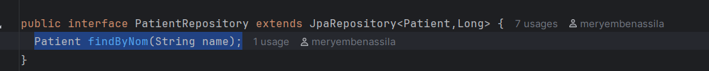

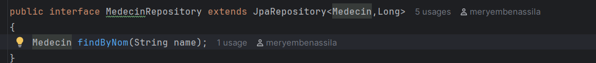

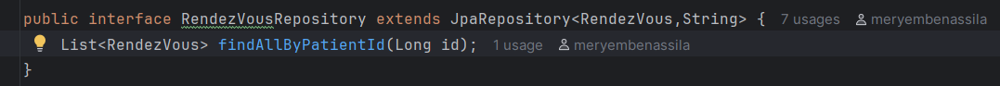

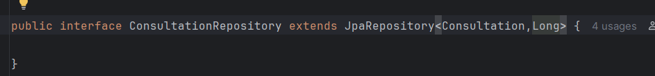

---

### Étape 4 : Test de la couche DAO

Pour tester la couche DAO, nous avons utilisé **CommandLineRunner** afin d'ajouter quelques données de test (patients, médecins, rendez-vous, etc.) dans la base de données au démarrage de l'application.

Cela permet de vérifier que les **Repositories** fonctionnent correctement et que la communication entre l'application et la base de données est bien établie.


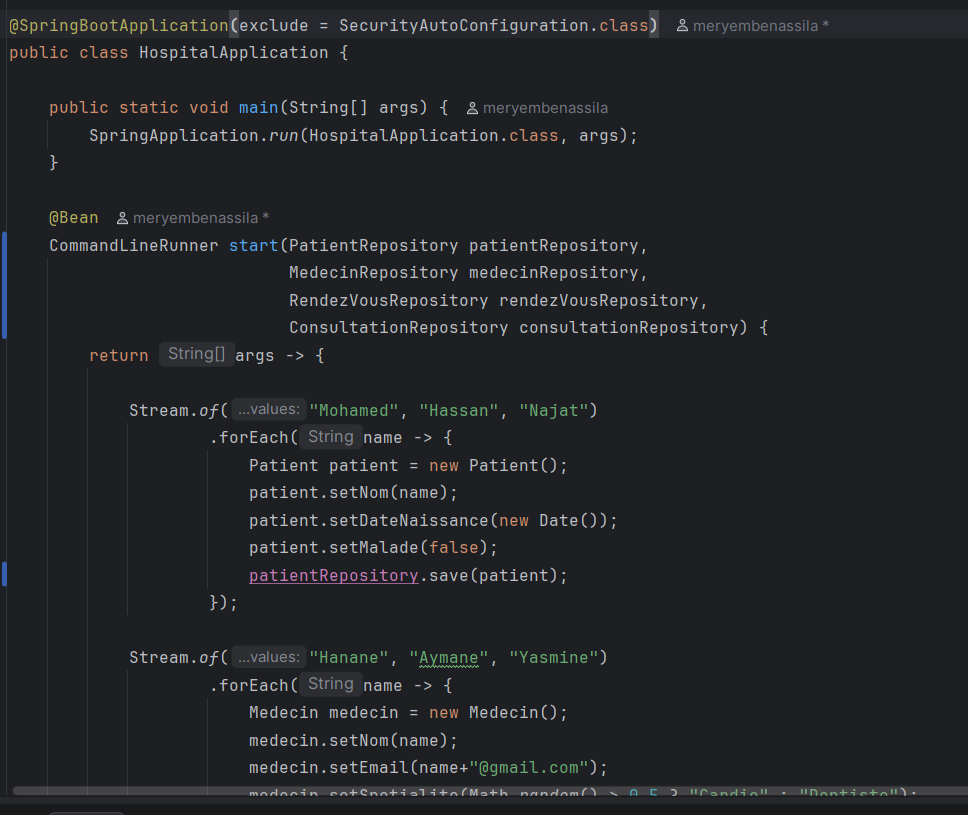

---

### Étape 5 : Désactivation temporaire de Spring Security

Afin de faciliter les tests de l'application au début du développement, la protection par défaut de Spring Security a été désactivée temporairement.

Cela permet d'accéder aux pages de l'application sans authentification.
pour la désactiver on a ajouté une condition a l'annotation **@SpringBootApplication** :


---

### Étape 6 : Création de la couche Service

Dans cette étape, nous avons créé la **couche Service** pour notre application afin de **séparer la logique métier de l'accès aux données**.  
Cette couche se situe entre les **Controllers** (maintenant dans notre cas c'est  la classe principale pour les tests) et les **Repositories**.

La couche Service permet de :

- **Centraliser la logique métier** : toutes les règles et traitements liés aux patients, médecins, rendez-vous et consultations sont gérés ici.
- **Faciliter la maintenance** : si la logique change, il suffit de modifier le service sans toucher au Controller ou au Repository.
- **Réutiliser le code** : plusieurs parties de l’application peuvent utiliser les mêmes services.


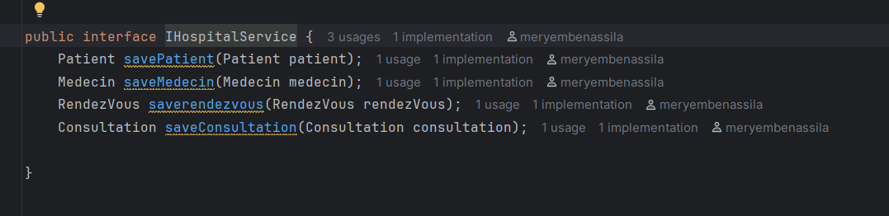

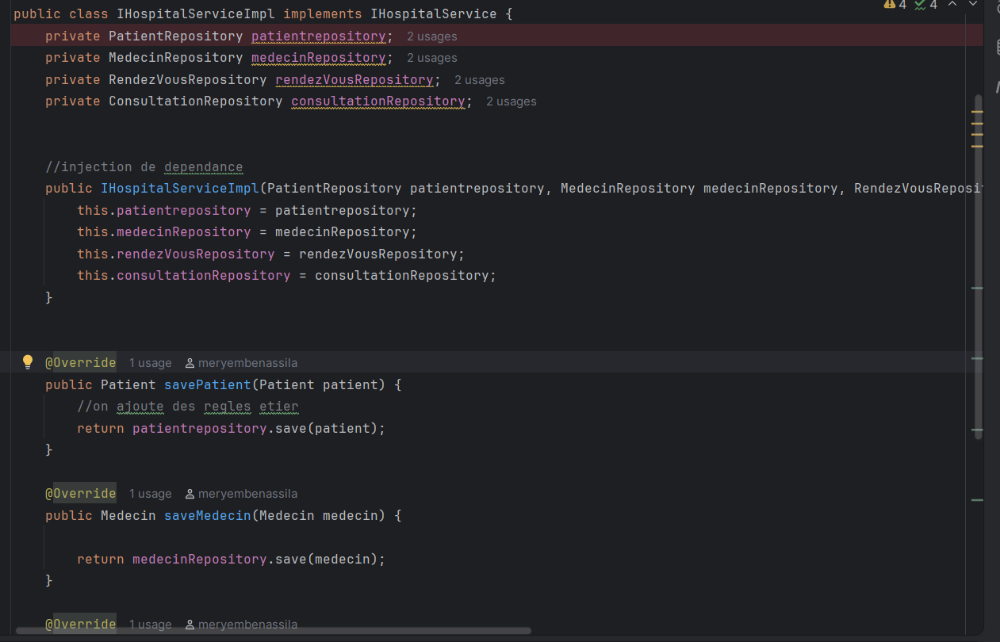


---

### Étape 7 : Création des Controllers

Dans cette étape, nous avons créé les **Controllers** pour gérer les interactions avec les utilisateurs.

Nous avons créé par exemple :

- **PatientController** pour gérer les patients
- **RendezVousController** pour gérer les rendez-vous


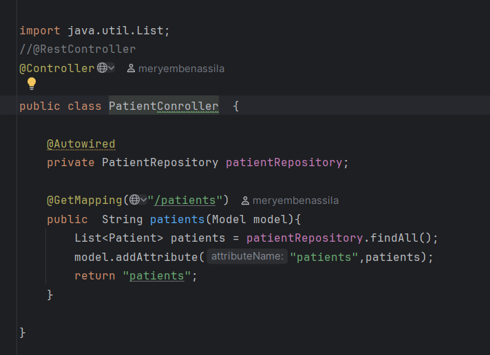

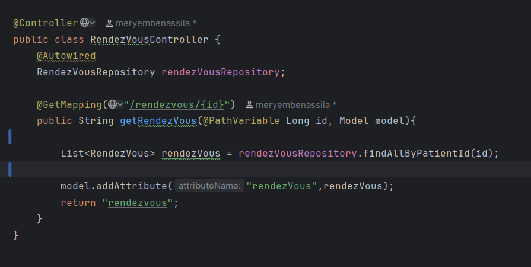


---
### les Fonctionnalités

- lister les patients .
  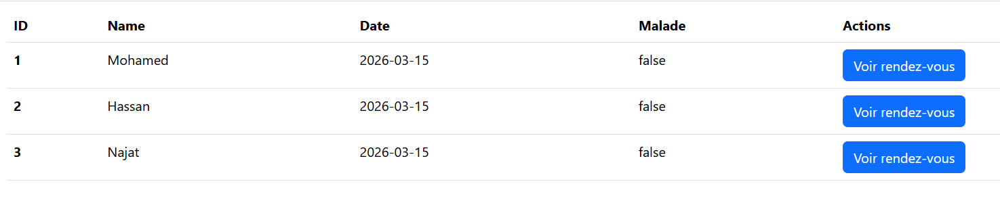
- lister les rendez vous de chaque patient.
  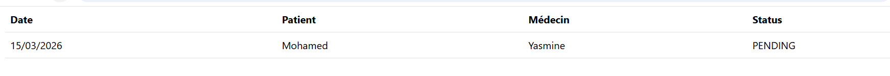

## Routes de l'application et permissions

| Route                    | Méthode | Description                        |
|--------------------------|---------|------------------------------------|
| /patients                | GET     | lister les patients                |
| /rendezvous/{id_patient} | GET     | lister les rendez vous du patient. |


## Lancer le projet

### Cloner le projet
```bash
https://github.com/meryembenassila/TP_Spring-MVC_SpringDataJPA-Hibernate_Patient.git
```

### Exécuter l'application

Lancer la classe principale  **TestSpringBootMVCAPP.java**

Ensuite, ouvrir dans le navigateur :
```bash
http://localhost:8086
```


